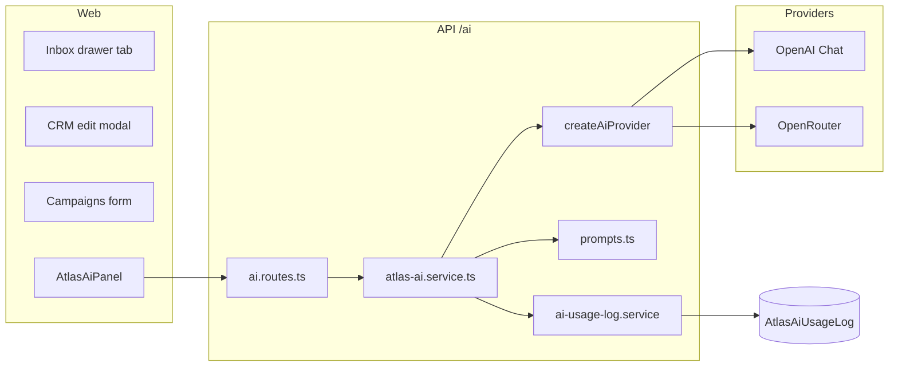

# Atlas AI V1 — Architecture

## Goal

First AI foundation inside Atlas One: six assistant features, provider abstraction, centralized prompts, usage logging, tenant isolation, and permission `ai:use` — without redesigning UI chrome or refactoring existing domain services.

## High-level flow

## Layers

| Layer | Responsibility |
|-------|----------------|
| **UI** | `AtlasAiPanel` — feature buttons, result rendering, apply-to-composer/message |
| **Client API** | `apps/web/src/lib/atlas-ai.ts` — typed calls to `/ai/*` |
| **Routes** | Auth + stacked permissions (`ai:use` + domain read) |
| **Service** | Load tenant-scoped context, call provider, parse JSON, log usage |
| **Providers** | `AiProvider.complete()` — OpenAI / OpenRouter / noop |
| **Prompts** | Single module `prompts.ts` — PT-BR system instructions + JSON schemas |
| **Usage log** | `AtlasAiUsageLog` per request (tokens, latency, status, entity) |

## Features → endpoints

| Feature | Endpoint | Domain permission |
|---------|----------|-------------------|
| Conversation summary | `POST /ai/conversations/:id/summary` | `conversation:read` |
| Suggested reply | `POST /ai/conversations/:id/suggested-reply` | `conversation:read` |
| Next best action | `POST /ai/conversations/:id/next-action` | `conversation:read` |
| Smart transfer summary | `POST /ai/conversations/:id/transfer-summary` | `conversation:read` |
| CRM lead summary | `POST /ai/leads/:id/summary` | `crm:read` |
| Campaign message improve | `POST /ai/campaigns/improve-message` | `campaign:read` |

`GET /ai/status` — provider configured (no LLM call).

## Provider selection

Environment (`apps/server/src/config/env.ts`):

- `ATLAS_AI_PROVIDER` — `openai` | `openrouter` (optional)
- `OPENAI_API_KEY` / `OPENROUTER_API_KEY`
- `ATLAS_AI_MODEL` — overrides default model
- `ATLAS_AI_APP_NAME` / `ATLAS_AI_APP_URL` — OpenRouter attribution headers

Priority: explicit `openrouter` + key → OpenRouter; else OpenAI key → OpenAI; else noop (503-style error message).

## Tenant isolation

- Every query uses `actor.tenantId` from JWT session.
- Conversations/leads loaded with `where: { tenantId }`.
- Usage rows always store `tenantId` + `userId`.
- Hidden messages excluded from prompts unless actor can view hidden (same rules as inbox).

## Permissions

- **`ai:use`** — required on all AI routes (owners/admins have `*`).
- Domain permission required in addition (e.g. `crm:read` for lead summary).
- UI panels render only when `hasPermission(user, "ai:use")`.

## Data model

`AtlasAiUsageLog` — append-only audit of AI calls (feature, provider, model, tokens, latency, status, entity refs).

Migration: `prisma/migrations/20260603180000_atlas_ai_usage_log`.

## Extension points (future providers)

1. Implement `AiProvider` in `apps/server/src/services/ai/`.
2. Register in `create-ai-provider.ts`.
3. Add env keys in `config/env.ts`.
4. No prompt changes required unless feature-specific.
